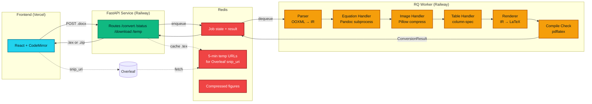
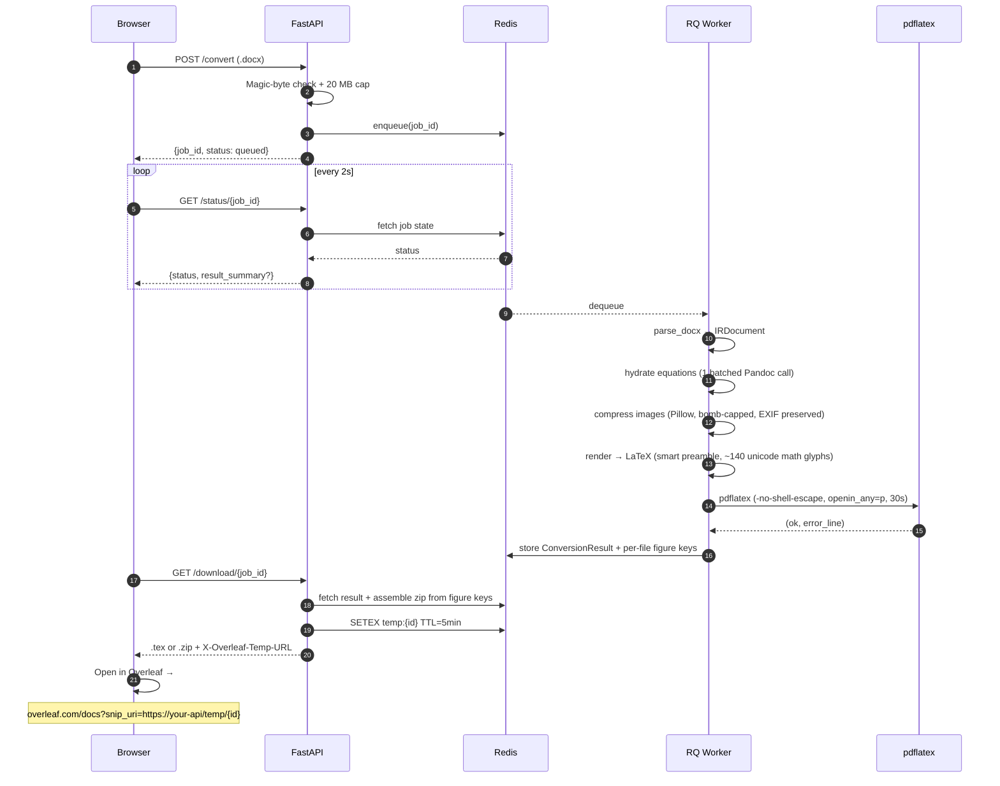
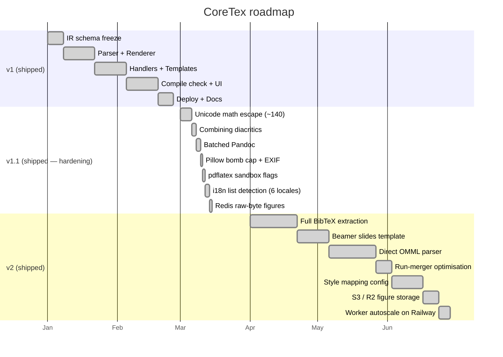

<div align="center">


# CoreTex

### Production-grade Word → LaTeX converter for academic writers

**Drop a `.docx`. Get compilable LaTeX. Open in Overleaf in one click.**

[](https://github.com/TheClazer/CoreTex/actions)
[](LICENSE)
[](https://www.python.org/)
[](https://fastapi.tiangolo.com/)
[](https://react.dev/)
[](https://www.typescriptlang.org/)
[](https://www.docker.com/)
[](https://redis.io/)
[](https://www.latex-project.org/)
[](tests/)
[](https://github.com/TheClazer/CoreTex/pulls)

<p>
  <a href="#quick-start">Quick Start</a> ·
  <a href="#architecture">Architecture</a> ·
  <a href="#features">Features</a> ·
  <a href="#api">API</a> ·
  <a href="DEPLOY.md">Deploy</a> ·
  <a href="#roadmap">Roadmap</a>
</p>

</div>

---

## Why CoreTex

> Academic writers draft in Word. Conferences demand LaTeX. The gap between them eats hours.

CoreTex is a **compiler-style pipeline** that converts Microsoft Word documents into compilable LaTeX with academic-grade fidelity. It targets IEEE, ACM, and Springer conference submissions — but works for any LaTeX writing.

|  | Hand re-typing | Pandoc CLI | mammoth.js | **CoreTex** |
|---|:---:|:---:|:---:|:---:|
| Equations (OMML) | Yes | Partial | No | Yes (batched) |
| Unicode math (∈ ℝ X̃ α∇∑) → math mode | Yes | No | No | Yes (~140 glyphs) |
| Tables + alignment | Yes | Partial | No | Yes |
| Citations detected | Partial | No | No | Yes |
| IEEE / ACM / Springer templates | Yes | No | No | Yes |
| i18n list detection (FR/DE/ES/IT/PT) | Yes | Partial | No | Yes |
| Compile check + error line | n/a | No | No | Yes |
| Overleaf one-click | No | No | No | Yes |
| Decompression-bomb hardening | n/a | No | No | Yes |
| Web UI | No | No | No | Yes |
| Time to convert 20-page paper | ~3 hours | ~10 min¹ | ~10 min¹ | **~3 seconds** |

<sub>¹ Plus manual cleanup, structural fixes, template porting, etc.</sub>

---

## Architecture

CoreTex follows a **strict compiler-style Intermediate Representation (IR)** pattern. The parser never produces LaTeX strings; the renderer never reads Word XML. The IR is the only shared contract — making each layer independently testable.



### The seven layers (bible §2)

| # | Layer | Purpose |
|---|---|---|
| 1 | **Ingestion** (FastAPI) | MIME magic-byte validation, 20 MB cap, BytesIO only, enqueue RQ job |
| 2 | **Surgical Parser** (python-docx + lxml) | Walks OOXML tree → typed IR nodes |
| 3 | **IR Schema** (Pydantic v2) | FROZEN contract: 10 node types |
| 4 | **Specialist Handlers** | Equations (Pandoc), images (Pillow), tables (column alignment) |
| 5 | **IR Renderer** (pure Python + Jinja2) | IR → LaTeX with smart preamble injection |
| 6 | **Bibliography** | Managed Word sources → `references.bib` + `\cite`; un-managed → `[CITATION]` marker |
| 7 | **Packager** | `.tex` or `.zip` + Overleaf temp URL + pdflatex check |

### Request lifecycle



---

## Features

<table>
<tr>
<td width="50%" valign="top">

### Content fidelity
- Headings H1–H4 → `\section` … `\paragraph`
- Bold / italic / underline / monospace runs
- Ordered & unordered lists, **nested 3+ levels**, **6 locales**
- Tables with `booktabs` + alignment from `<w:jc>`
- Merged cells via `\multicolumn`
- Embedded images with `\includegraphics` + EXIF/ICC preserved
- Footnotes, hyperlinks, page breaks
- OMML equations (inline `$` & display `equation`) — **single batched Pandoc call**, with a **Pandoc-free direct OMML→LaTeX fallback** so equations still convert when Pandoc is absent
- Word citations → **`\cite` + generated `references.bib`** for managed sources; un-managed citations fall back to a `[CITATION]` marker
- **~140 Unicode math glyphs** auto-converted (ℝ ∈ ∑ ∇ α β X̃ x̂ ⁿᵇⁱ etc.)
- **Adjacent-run merger** collapses Word's per-word/rsid fragmentation

</td>
<td width="50%" valign="top">

### Academic templates (5)
- **article** — default LaTeX class
- **IEEE Transactions** — `IEEEtran`
- **ACM SIGCONF** — `acmart`
- **Springer LNCS** — `llncs`
- **Beamer slides** — one frame per heading, auto `allowframebreaks`

### Customisation + scale (v2)
- **Style mapping config** — map custom Word style names → headings/code/lists via `CORETEX_STYLE_MAP`
- **S3 / Cloudflare R2 figure storage** — set `FIGURE_STORAGE=s3` to offload figures off Redis
- **Horizontal worker scaling** — RQ replicas (`numReplicas`) clear queue head-of-line blocking

### Accounts + history (v1.2)
- Email + password sign-up / sign-in (bcrypt-hashed)
- Google + GitHub OAuth (optional, configured via env vars)
- **SHA-256 dedup** — re-uploading an identical .docx returns the
  cached conversion in <100 ms, skipping the full pipeline
- Per-user history page with re-download (.zip with figures intact)
- JWT bearer tokens (7-day default)
- Anonymous usage still allowed — auth is purely additive

### Production-grade
- MIME magic-byte validation + **streaming-cap upload** (no OOM)
- 20 MB hard upload cap, 10 req/min/IP rate limit
- Pillow image compression with **40 MP decompression-bomb cap**
- EXIF + ICC profile preservation through re-encode
- pdflatex with `-no-shell-escape` + `openin_any=p` + 30 s timeout
- TeX Live compile check with error line back-to-CodeMirror
- **No `pickle` on the wire** — Redis stores raw bytes only
- Explicit CORS allowlist (no wildcard + credentials footgun)

</td>
</tr>
<tr>
<td width="50%" valign="top">

### Smart preamble injection
The renderer walks the IR and **only emits the packages the document actually uses** — `graphicx` for images, `amsmath` + `amssymb` for equations *or* Unicode math glyphs (`ℝ`, `∇`, `X̃`…), `hyperref` for links, `booktabs` for tables, `enumitem` for lists. No bloat. No conflicts. No "unused package" warnings.

</td>
<td width="50%" valign="top">

### UX details
- CodeMirror 6 with `stex` syntax highlighting
- Compile-error line **decorated red + scrolled into view**
- Drag-and-drop with keyboard accessibility
- Animated status pill + elapsed-time counter
- Toast on clipboard copy
- Mobile responsive < 880 px
- Full ARIA + `aria-live` for screen readers

</td>
</tr>
</table>

---

## Quick Start

> **Prerequisites:** [Docker Desktop](https://www.docker.com/products/docker-desktop/) + [Node.js 20+](https://nodejs.org)

```bash
# 1. Clone
git clone https://github.com/TheClazer/CoreTex.git
cd CoreTex

# 2. Backend (Redis + API + RQ worker + TeX Live, all in Docker)
docker compose up --build

# 3. Frontend (new terminal)
cd frontend
npm install
npm run dev
```

Open <http://localhost:5173>, drop a `.docx`, pick a template, hit **Convert →**.

> First Docker build pulls ~1.5 GB of TeX Live for the compile check. Skip it with `docker compose build --build-arg INSTALL_TEXLIVE=0` for fast iteration.

### Running the tests

```bash
# Backend — unit + integration suite (escape, parser, renderer,
# golden-doc regression on .docx fixtures, HTTP integration, v2 features)
pytest tests/ -v

# Frontend — Vitest + tsc
cd frontend && npm test
```

---

## Tech Stack

<div align="center">

| Layer | Tools |
|---|---|
| **Backend** |     |
| **Queue** |   |
| **Word parsing** |   |
| **LaTeX** |    |
| **Images** |  |
| **Frontend** |     |
| **Tests** |    |
| **CI/CD** |   |
| **Deploy** |   |

</div>

---

## API

Base URL: `http://localhost:8000` (dev) · your Railway domain (prod)

| Method | Path | Purpose |
|---|---|---|
| `POST` | `/convert?template=<article\|ieee\|acm\|springer\|beamer>` | Upload `.docx`, returns `{job_id, status: "queued"}` |
| `GET` | `/status/{job_id}` | Polled every 2 s. Returns `{status, result_summary?}` with citation/warning counts, compile error line. |
| `GET` | `/download/{job_id}` | `.tex` (text/plain) or `.zip` (with `figures/` + `references.bib`). Adds `X-Overleaf-Temp-URL` header. |
| `GET` | `/temp/{job_id}[.tex\|.zip]` | Public 5-min snip URL — Overleaf's `snip_uri` target. Suffix lets Overleaf detect the type from the URL. |
| `GET` | `/auth/providers` | Returns which auth methods are configured. |
| `POST` | `/auth/signup` | `{email, password, display_name?}` → JWT. |
| `POST` | `/auth/login` | `{email, password}` → JWT. |
| `GET` | `/auth/me` | Current user (requires Bearer token). |
| `GET` | `/auth/{google\|github}/start` | 302 → OAuth provider. |
| `GET` | `/auth/{google\|github}/callback` | OAuth return path; redirects to frontend with `#token=...`. |
| `GET` | `/history` | List of the user's conversions (paginated). |
| `GET` | `/history/{id}` | One conversion's metadata + `.tex` + figure filenames. |
| `GET` | `/history/{id}/download` | Re-download the `.tex` or `.zip`. |
| `DELETE` | `/history/{id}` | Remove a conversion from history. |

<details>
<summary><b>Example: full conversion flow</b></summary>

```bash
# 1. Submit
JOB=$(curl -s -X POST 'http://localhost:8000/convert?template=ieee' \
  -F 'file=@paper.docx' | jq -r .job_id)

# 2. Poll
while true; do
  STATUS=$(curl -s "http://localhost:8000/status/$JOB" | jq -r .status)
  echo "$STATUS"
  [[ "$STATUS" == "finished" || "$STATUS" == "failed" ]] && break
  sleep 2
done

# 3. Download
curl -OJ "http://localhost:8000/download/$JOB"
```

</details>

---

## Repository Layout

```
CoreTex/
├── app/
│   ├── main.py                       FastAPI entry
│   ├── config.py                     Pydantic Settings
│   ├── api/routes.py                 convert / status / download / temp
│   ├── api/history_routes.py         user conversion history
│   ├── queue/worker.py               RQ orchestrator
│   ├── storage.py                    figure store (Redis default, S3/R2 optional)
│   ├── converter/
│   │   ├── ir_schema.py              FROZEN Pydantic IR (10 nodes)
│   │   ├── parser.py                 OOXML → IRDocument
│   │   ├── renderer.py               IRDocument → LaTeX
│   │   ├── bibliography.py           Word sources → references.bib
│   │   ├── run_merger.py             adjacent-run merging
│   │   ├── style_map.py              custom Word style mapping
│   │   ├── escape.py                 reserved + Unicode
│   │   ├── compile_check.py          pdflatex + error parsing
│   │   └── handlers/
│   │       ├── equation_handler.py   OMML → LaTeX via Pandoc (+ direct fallback)
│   │       ├── omml_direct.py        Pandoc-free OMML → LaTeX
│   │       ├── image_handler.py      Pillow compression
│   │       └── table_handler.py      column-spec
│   └── templates/                    article / ieee / acm / springer / beamer
├── frontend/                         React + Vite + TS
│   └── src/
│       ├── App.tsx
│       ├── hooks/useConversion.ts    Upload → poll → download
│       └── components/               UploadZone, LatexEditor, …
├── tests/                            unit + integration + golden-doc + v2
├── .github/workflows/ci.yml          pytest + ruff + vitest + tsc
├── Dockerfile + docker-compose.yml
├── railway.toml                      Backend deploy
├── frontend/vercel.json              Frontend deploy
└── DEPLOY.md                         Step-by-step deploy walkthrough
```

---

## Deployment

CoreTex is built for **Railway (backend + worker + Redis) + Vercel (frontend)**.

**[Follow the step-by-step walkthrough in DEPLOY.md](DEPLOY.md)** — every manual step is marked `→ You:` so you know what's automatic vs what needs your attention.

> **Overleaf integration requires public deployment.** When running locally, Overleaf's servers can't reach your `localhost`, so the "Open in Overleaf" button needs the backend to be deployed. Use the download button locally; the Overleaf button activates once you're on Railway.

---

## Architectural Decisions

<details>
<summary><b>Why a custom renderer instead of Pandoc end-to-end?</b></summary>

Pandoc adds its own structural commands (`\tightlist`, custom list macros, heading style resets) that **collide** with the IR renderer's output, producing duplicate or contradictory formatting that frequently fails to compile.

Pandoc is invoked **only** in the equation handler, on individual OMML fragments. Document structure is 100% custom-rendered.
</details>

<details>
<summary><b>Why python-docx + lxml instead of mammoth.js?</b></summary>

mammoth.js is a Node.js library built for Word → HTML. It exposes **no** access to OMML equations, paragraph properties, citation XML fields, or run structure. Using it would require running a Node subprocess from Python — and we'd still lack equation support. python-docx + lxml gives full OOXML access in-process.
</details>

<details>
<summary><b>Why is the IR schema frozen?</b></summary>

The parser writes IR; the renderer reads IR. If anyone renames a field mid-project without coordination, the renderer breaks silently. Freezing the schema after Week 1 — and requiring an explicit `schema/<change>` branch + team sign-off — ensures Pydantic surfaces drift as a `ValidationError` rather than a silent corruption.
</details>

<details>
<summary><b>Why not back-map LaTeX errors to the source Word paragraph?</b></summary>

Mapping `pdflatex` errors back through the IR to the original Word paragraph is **extremely** complex (LaTeX line numbers don't correspond to IR node indices). Practical alternative: surface the LaTeX line number in the warnings panel and have CodeMirror scroll to + highlight it. Users can fix there or open the document in Overleaf.
</details>

<details>
<summary><b>Why convert Unicode math glyphs at the escape layer instead of in math mode upstream?</b></summary>

Authors paste characters like `ℝ`, `∈`, `X̃`, `α∇∑` into normal text runs without ever opening Word's equation editor. Those characters reach the parser as paragraph text — not as `<m:oMath>` — so the equation handler never sees them. Catching them at the escape layer means a single pass over every text string is enough; consecutive glyphs merge into a single `$…$` region with `^a^b^c` → `^{abc}` grouping so `pdflatex` doesn't raise "double superscript".

The renderer also detects when any text run contains a math glyph and auto-injects `\usepackage{amssymb}` so `\mathbb{R}` resolves. Documents without math glyphs don't pull in the package.
</details>

<details>
<summary><b>Why batch all equations through a single Pandoc call?</b></summary>

Pandoc's startup cost is ~400 ms on a warm machine. A paper with 150 equations would block the worker for **~60 seconds** if each fired its own subprocess. We instead synthesize a single `.docx` with N paragraphs (one per equation), each sandwiched between unique ASCII sentinels, then call Pandoc once and split the output back into per-equation chunks by regex. A 150-equation paper converts in ~0.6 s.
</details>

<details>
<summary><b>Why raw bytes in Redis instead of pickled artefacts?</b></summary>

`pickle.loads` on untrusted Redis data is an RCE primitive. Even though Redis is internal, treating that boundary as trusted is the same mistake that broke a thousand other systems. Each figure is stored as a separate raw-byte key (`figures:{job_id}:f:{name}`) alongside a newline-delimited manifest of filenames. No Python-specific wrapper, no deserialisation risk, and individual figures can be looked up without loading the whole dict.
</details>

---

## Known Limitations

### Content
| Area | Limitation | Tracked in |
|---|---|---|
| Citations | v2: managed Word sources → `references.bib` + `\cite`; un-managed citations fall back to plain text | shipped |
| Tables | Merged-cell rendering uses `\multicolumn` only (no row spans) | v3 roadmap |
| Equations | Pandoc gives best fidelity; without it a built-in direct OMML→LaTeX fallback covers common constructs (fractions, scripts, radicals, n-ary ops, Greek/symbols) | shipped (v2) |
| Compile errors | LaTeX line number is surfaced; no back-mapping to original Word paragraph | bible §6 |
| Tracked changes | Revision markup stripped; final text only | bible §9 |
| Resume-style layouts | Per-word formatting + tabs produce verbose output | bible §9 |

### Scaling
| Area | Trade-off | Upgrade path |
|---|---|---|
| Upload size | Hard 20 MB cap | Set `MAX_FILE_SIZE_MB`; bump Railway RAM |
| Worker count | Single RQ worker blocks under load | Set `numReplicas` on the worker service (implemented, v2) |
| Figure storage | Redis by default (5-min TTL, ~50 MB ceiling) | `FIGURE_STORAGE=s3` for S3 / Cloudflare R2 (implemented, v2) |
| Upload memory | ~5× duplication at peak (HTTP → buffer → RQ → Redis → worker) | Presigned PUT to S3, pass key through RQ |
| TeX Live image | 1.5 GB Docker layer; ~30 s cold start | Pre-warm with min-replicas, or `INSTALL_TEXLIVE=0` |

See [DEPLOY.md → Scaling constraints](DEPLOY.md#scaling-constraints-known-v1-limits) for the full upgrade-path discussion.

Full feature scope (v1 vs v2) lives in `word_latex_bible.pdf §9`.

---

## Roadmap



---

## Contributing

PRs welcome. Please follow the bible's branch conventions:

- `feature/<area>-<short-desc>` — new functionality
- `fix/<area>-<short-desc>` — bug fixes
- `schema/<change-desc>` — IR schema changes (requires team sign-off)

Every PR must:

1. Keep the backend test suite passing (`pytest tests/`)
2. Keep frontend tests passing (`npm test`)
3. Pass `ruff check` + `tsc --noEmit`
4. Not regress on any golden doc in `tests/golden/`

CI enforces all four — see `.github/workflows/ci.yml`.

---

## License

Distributed under the **MIT License**. See [LICENSE](LICENSE) for full text.

```
Copyright (c) 2026 Rayyan Shaikh and CoreTex contributors
```

---

## Acknowledgements

Built around the principles laid out in `word_latex_bible.pdf` v1.0 —
a compiler-style IR pipeline, schema-first design, and per-layer ownership.

Standing on the shoulders of: [FastAPI](https://fastapi.tiangolo.com/) ·
[python-docx](https://python-docx.readthedocs.io/) ·
[Pandoc](https://pandoc.org/) ·
[CodeMirror](https://codemirror.net/) ·
[Pillow](https://python-pillow.org/) ·
[Overleaf](https://www.overleaf.com/) ·
[TeX Live](https://tug.org/texlive/)

---

<div align="center">

[Star this repo](https://github.com/TheClazer/CoreTex) if CoreTex saved you time.

Built by [@TheClazer](https://github.com/TheClazer)

</div>
